# Exoplanet Exomoon Simulation


Interactive browser simulation for exoplanet transit photometry, binary eclipses, exomoon scenarios, and timing diagnostics. The core is deterministic and SI-based, with didactic curve/canvas overlays for contact timing, component decomposition, chromatic observer lanes, A/B comparison, and black-box lesson flows.

## Screenshots

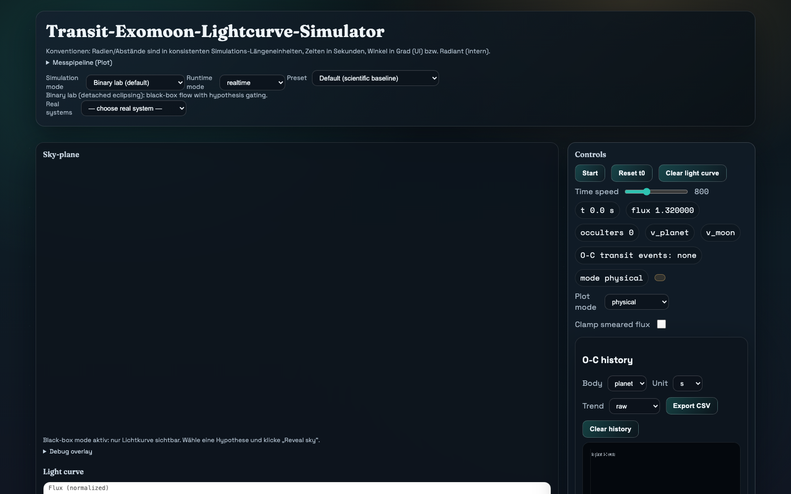

Feature gallery:

**Main simulation shell**: sky-plane, light curve, controls, diagnostics, and the fixed-range didactic plot surface.

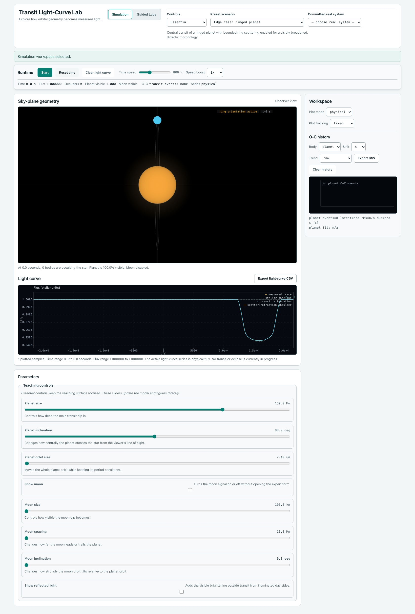

**Light-curve landmarks**: contact markers, component overlays, and teaching badges on the active transit plot.

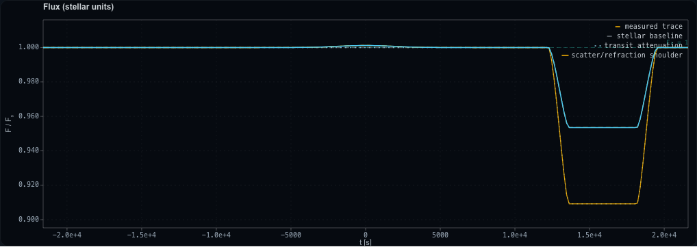

**Scene geometry overlays**: chord/lead-lag style annotations and separated moon geometry on the sky canvas.

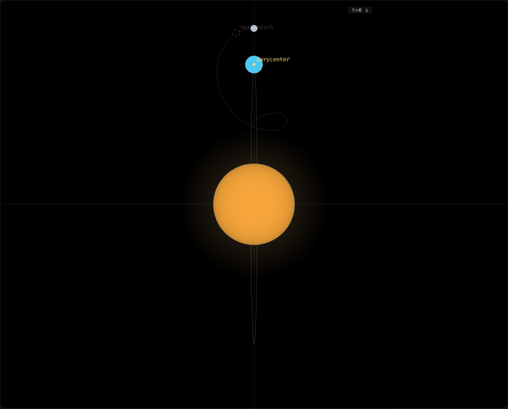

**A/B compare lab**: overplotted scenarios, delta inset, and scene ghosts for false-positive style comparison work.

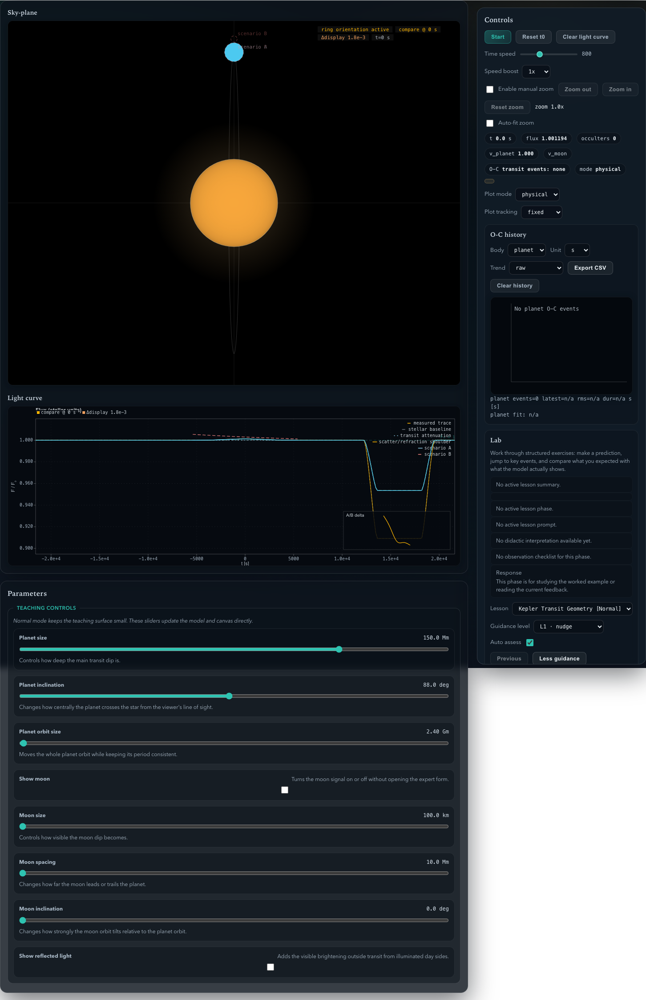

**Chromatic lane**: weighted broadband band overlays on the measured curve.

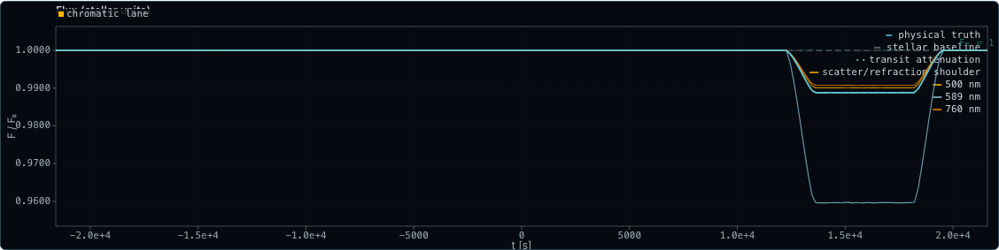

**Observer contamination lane**: measured-vs-physical separation with observer-side contamination cues.

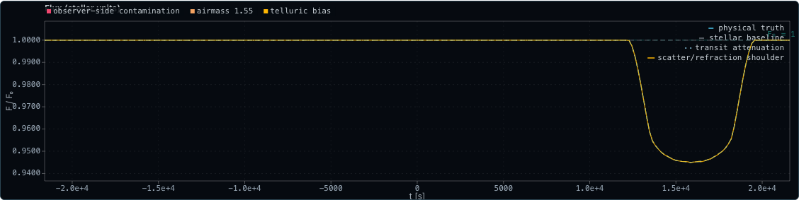

**Timing and dynamics**: timing markers, drift cues, and epoch-aware overlays on the combined visual surface.

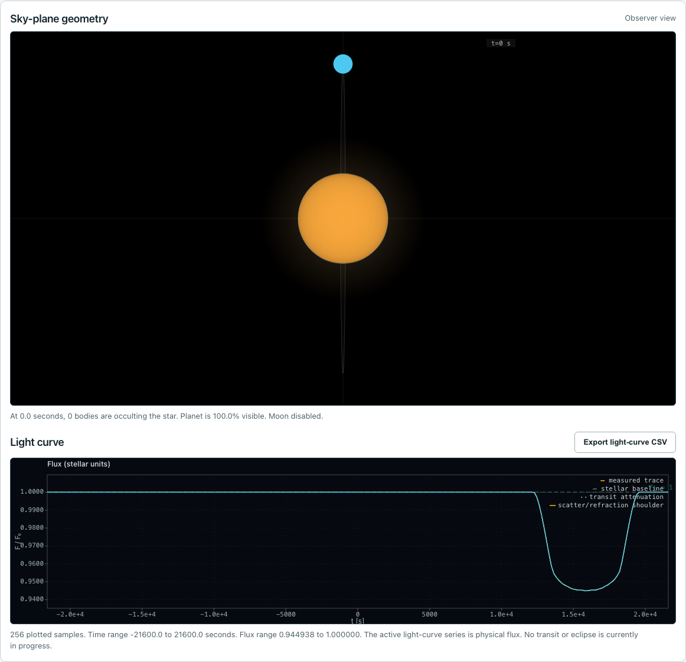

**Binary black-box lab**: guided detached-binary lesson flow with hypothesis gating and reveal.

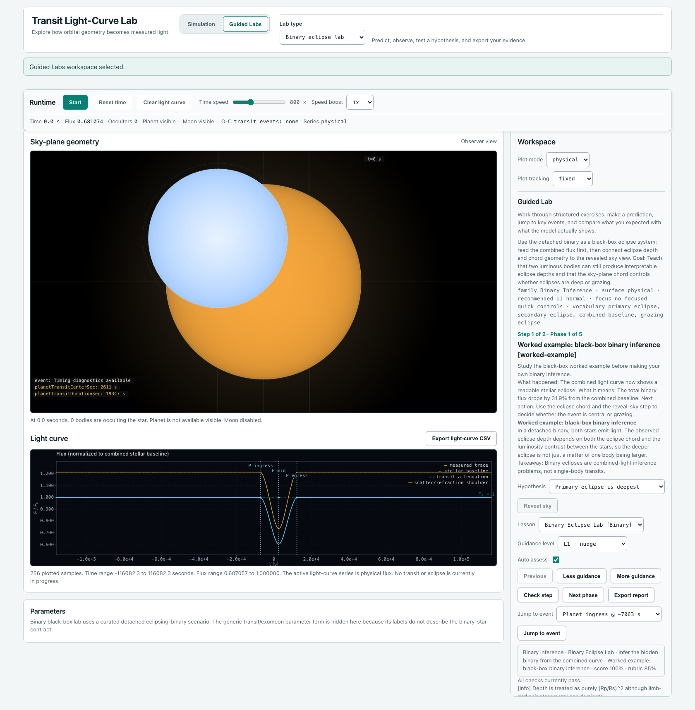

## Table of Contents

- [Highlights](#highlights)
- [Screenshots](#screenshots)
- [Architecture](#architecture)
- [How it works](#how-it-works)
- [Application lifecycle](#application-lifecycle)
- [Quick Start](#quick-start)
- [Runtime Modes](#runtime-modes)
- [Real Systems Snapshot](#real-systems-snapshot)
- [Scripts](#scripts)
- [Documentation](#documentation)
- [Project Layout](#project-layout)
- [Quality Gates](#quality-gates)
- [Known Limits](#known-limits)

## Highlights

- Native V4 runtime path with automatic legacy input migration.
- Preset and real-system flow as the default teaching entry.
- Realtime and reference runtime profiles.
- Transit, limb darkening, atmosphere hooks, phase curves, measurement smearing, and instrument noise.
- Active learner-facing overlays for event landmarks, timing markers, flux decomposition, compare insets, scene ghosts, and geometry annotations.
- Physical-vs-measured curve lanes with bounded chromatic overlays, observer contamination badges, and fixed shared-scale comparison support.
- Forward scattering, ring scattering, and bounded refraction are available on the active V4 runtime path.
- Detached-binary lab uses a curated detached eclipsing-binary scenario with explicit per-star stellar metadata in V4 configs and stays normalized to the combined stellar baseline.
- Dynamic diagnostics (timing, conservation, RV, astrometry).
- Didactics: black-box flow, hypothesis gate, locks, hints, compare labs, rubric scoring.
- Versioned "real systems" snapshot from NASA Exoplanet Archive with freshness metadata.

## Architecture

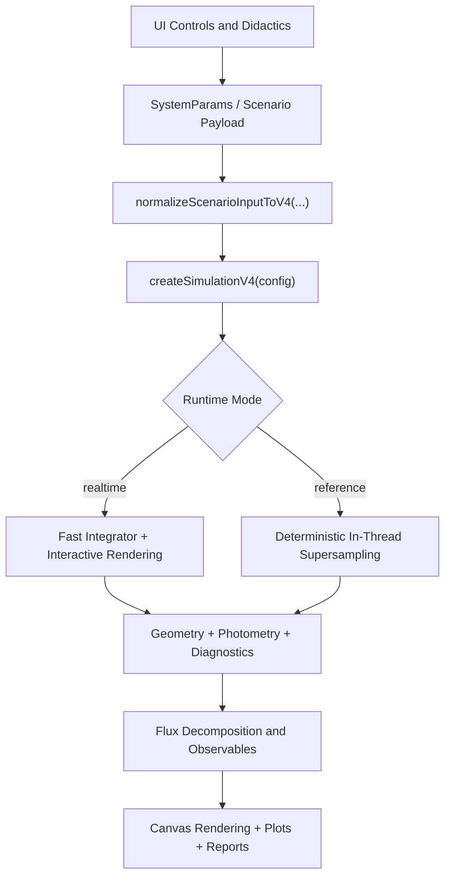

Didactic progression in Binary Lab:

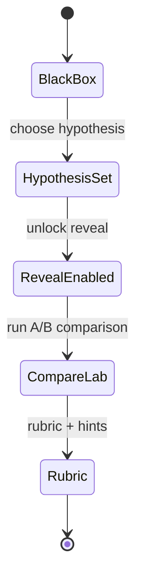

## How it works

End-to-end execution flow from page load to the running simulation:

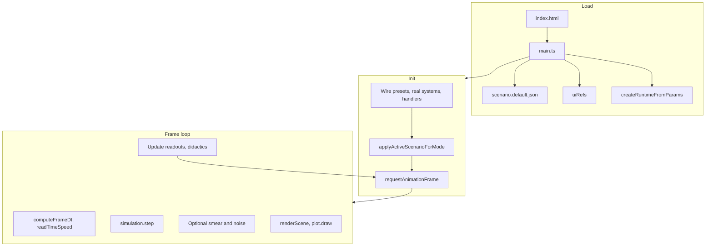

User actions (Apply, Reset, Preset, Real system, or mode change) update params and call `rebuildSimulationFromParams()` or `resetSimTimeAndLC()` as in the Architecture flow; the frame loop keeps running and reflects the new state on the next frame.

The learner-facing shell now exposes three complementary views of the same step state:

- sky-plane geometry and semantic overlays from `renderSignals`
- light-curve overlays, markers, compare insets, and contamination windows
- didactics/lab controls that lock or reveal parts of the interface depending on the active lesson mode

## Application lifecycle

Main application states and transitions:

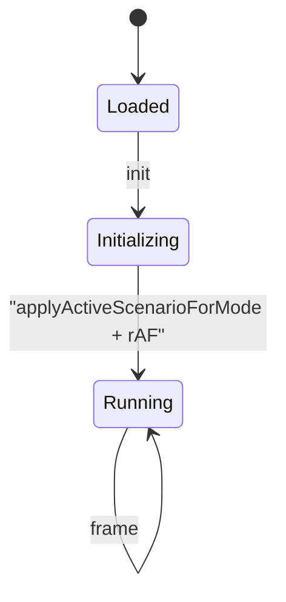

## Quick Start

Recommended:

```bash
pnpm install --frozen-lockfile
pnpm dev
```

Open [http://localhost:5173](http://localhost:5173).

## Runtime Modes

- `Preset / real systems` is the default flow.
- `Binary lab` remains available as a curated black-box detached-eclipsing-binary lesson path.
- `Preset / real systems` can be selected at any time.
- `Runtime mode` supports:
  - `realtime`: interactive stepping.
  - `reference`: deterministic in-thread supersampling.

Binary Lab contract:

- Binary Lab is a guided detached-eclipsing-binary lesson surface, not a general editable binary-parameter workbench.
- The app now hides the generic transit/exomoon parameter form and the planet/moon O-C panel while Binary Lab is active, because those labels describe the other simulation surfaces rather than the detached-binary black-box contract.

Main runtime entry points:

- `src/sim/v4/runtime.ts`
- `src/app/v4Runtime.ts`

## Real Systems Snapshot

The `Real systems` dropdown uses a versioned snapshot in:

- `src/config/real-systems.snapshot.json`

Manual refresh command:

```bash
pnpm data:real-systems:refresh
```

CI also checks that the committed snapshot metadata stays fresh enough for review.

## Scripts

- `pnpm dev`: start Vite dev server
- `pnpm build`: production build
- `pnpm preview`: preview build
- `pnpm start`: preview the built app (`vite preview`)
- `pnpm smoke:served`: build + serve + probe the shipped browser surface
- `pnpm lint`: lint and formatting checks
- `pnpm typecheck`: TypeScript checks
- `pnpm test`: unit and smoke tests
- `pnpm test:coverage`: coverage threshold gate
- `pnpm ci:verify`: lint + typecheck + test + build
- `pnpm audit:deps`: dependency hygiene gate
- `pnpm migrate:v4`: migrate legacy scenario payloads to V4
- `pnpm literature-benchmarks`: benchmark gate
- `pnpm scientific-calibration`: scientific calibration gate
- `pnpm didactics-acceptance`: didactics flow gate
- `pnpm perf-smoke`: performance smoke gate
- `pnpm migration-regression`: migration gate
- `pnpm capture:github-screenshots`: regenerate the GitHub screenshot set from the live app shell

## Documentation

| Topic                     | Path                                               |
| ------------------------- | -------------------------------------------------- |
| Docs index                | `docs/README.md`                                   |
| Parameters and UI mapping | `docs/params.md`                                   |
| Physics overview          | `docs/physics/overview.md`                         |
| Full derivation           | `docs/physics/full-derivation.md`                  |
| N-body details            | `docs/physics/nbody.md`                            |
| Orbit model               | `docs/physics/orbits.md`                           |
| Relativity model          | `docs/physics/relativity.md`                       |
| Photometry model          | `docs/physics/photometry.md`                       |
| Visualization contract    | `docs/rendering/physics-visualization-contract.md` |
| Validation and warnings   | `docs/validation.md`                               |
| CI model                  | `docs/ci.md`                                       |
| Runbook                   | `docs/RUNBOOK.md`                                  |
| Contributing              | `CONTRIBUTING.md`                                  |
| Security policy           | `SECURITY.md`                                      |

## Project Layout

```text
src/
  app/         scenario selection, runtime builders, didactics wiring
  config/      defaults and real-systems snapshot
  core/        shared types and units
  didactics/   lesson engine, rubric, reports
  photometry/  transit and additive flux components
  physics/     kepler, frames, relativity, utility math
  render/      canvas scene and overlays
  sim/         runtime orchestration and integrators
  ui/          DOM references and parameter mapping
```

## Quality Gates

Primary local verification:

```bash
./scripts/ci-local.sh       # install + ci:verify + served smoke + specialty gates
pnpm ci:verify              # lint + typecheck + all tests + build
pnpm smoke:served           # served browser shell smoke
pnpm test:coverage          # coverage thresholds
pnpm audit:deps             # dependency hygiene
pnpm literature-benchmarks  # physics correctness vs. published results
pnpm scientific-calibration # scientific calibration catalog + bounded reference lane
pnpm didactics-acceptance   # educational flow validation
pnpm perf-smoke             # interactive performance budget (<50ms/step)
pnpm physics-regression     # transit timing and dynamics regression
pnpm migration-regression   # V3 -> V4 backwards compatibility
```

Code quality enforcement:

- `@typescript-eslint/no-explicit-any` enforced as error in `src/`
- 35 module layering boundary tests (core -> physics -> photometry -> sim -> render/ui -> app)
- Property-based tests for numerical code (Kepler solver, vector ops, transit flux)
- Hygiene tests: file size budget (720 lines), `any` budget, no experimental imports

## Known Limits

- The repo now has a separate bounded `scientific-browser` runtime contract in the V4 path, but it is not the default shipped UX contract and it is still an incomplete `S1` fail-closed foundation rather than a finished scientific mode.
- Any existing `scientific` wording in rendering or didactics documents refers to presentation density or lesson/debug detail, not to a validated scientific execution mode.
- The browser-only `scientific-browser` roadmap currently treats these as explicitly out of scope until re-opened by a later milestone:
  - full stellar-atmosphere or SED-grid synthesis
  - full radiative-transfer atmosphere/transmission modeling
  - scientific support for every current additive toy photometry control
  - backend-dependent or remote-calibration scientific workflows
  - solver regimes whose cost cannot be benchmarked reliably in the browser
- Relativity corrections are modelled with practical approximations for browser execution.
- Atmospheric and stellar modules expose advanced hooks but are not a full radiative-transfer research solver.
- Detached-binary mode is a bounded relative-flux model for interactive eclipsing-binary teaching. It preserves per-star stellar metadata and benchmarked unequal-star/passband behaviour on the active Binary Lab path, but it is not a research-grade stellar-atmosphere or passband-synthesis solver.
- Some high-fidelity effects are intentionally profile-gated to preserve interactive performance.
- Mixed-shape occulters currently fall back to the non-transmissive solver when atmosphere transmission is enabled; the runtime now warns explicitly when that contract is hit.
- Guided Labs score the physical transit signal, not the measured/noisy display curve.

## Contributing and Security

- Contribution guidelines: `CONTRIBUTING.md`
- Security reporting: `SECURITY.md`

## License

MIT, see `LICENSE`.
