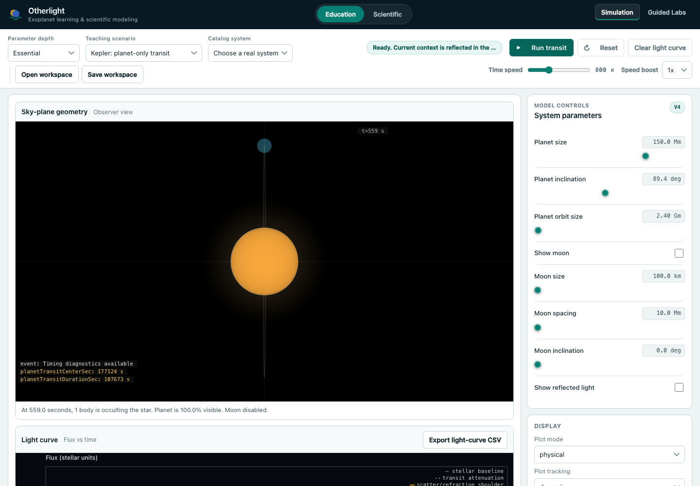
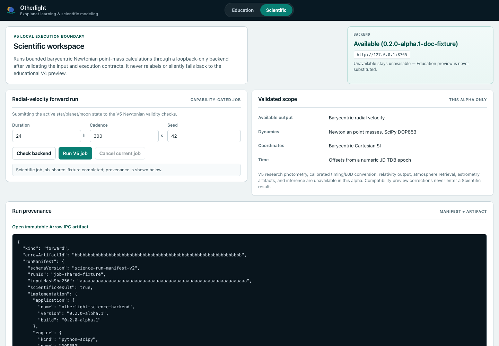
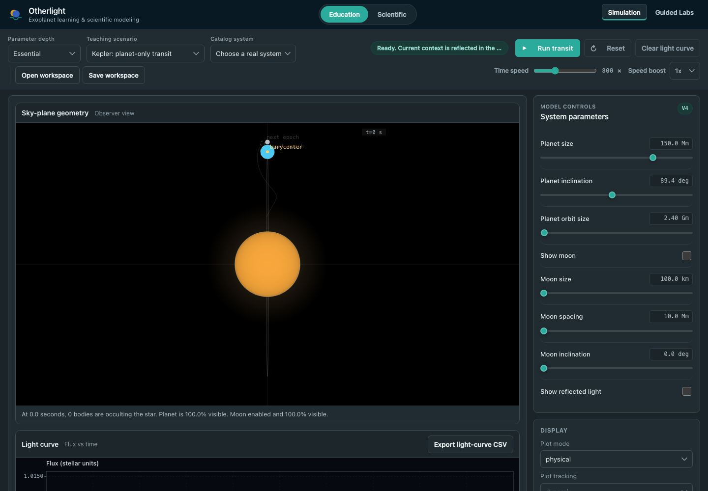

# Otherlight

Otherlight is a local exoplanet simulation and teaching workspace. The
repository contains three related applications:

- a TypeScript browser application for interactive Education simulations and
  Guided Labs;
- an optional Python service for bounded V5 radial-velocity calculations;
- an experimental SwiftUI Education application for macOS, iPhone, and iPad.

Explore the [structured static demo](https://sebastianspicker.github.io/otherlight/).
It is a simulated, non-executing tour built from sanitized repository fixtures
and maintained browser captures; it does not replace the local applications.

The browser Education runtime is the default. The Scientific workspace uses the
Python service only after it validates the service capability manifest. It does
not substitute an Education result when the service or requested capability is
unavailable.

## Screenshots

The maintained browser tour contains ten frames. The Scientific result frame
uses the checked-in V5 contract case, not a live service run. See
[`docs/tour.md`](docs/tour.md) and the adjacent manifest for capture modes,
hashes, dimensions, and browser versions.







## Project purpose and scope

The browser application supports parameter exploration, guided exercises, and
visual inspection of transit and eclipse signals. It uses SI units internally
and exposes numerical state through plots, textual summaries, CSV exports, and
workspace files.

The optional Python service accepts a strict V5 request, performs Newtonian
barycentric integration with SciPy DOP853, and writes radial-velocity results as
content-addressed Arrow files. The service binds to loopback and is not a
multi-user or remote service.

The native Apple application implements a narrower Education subset. It shares
versioned Education fixtures with the browser code but does not expose the
browser Scientific workspace, binary photometry, atmosphere models, N-body
runtime, or relativity runtime.

## Current capabilities

### Browser Education

- Simulation and Guided Labs product modes.
- Planet, exomoon, and detached-binary teaching scenarios.
- Interactive and deterministic reference runtime modes.
- Essential and advanced parameter controls.
- Transit and eclipse photometry, limb darkening, phase curves, atmosphere
  preview effects, scattering, rings, smearing, and synthetic measurement
  noise.
- Timing, radial-velocity, astrometry, conservation, and event diagnostics where
  the active runtime provides them.
- Saved `.otherlight` workspaces, shareable route state, CSV export, and lesson
  report export.
- A committed real-system catalog derived from a NASA Exoplanet Archive
  snapshot.

### Scientific service

- Strict V5 forward-job requests.
- Newtonian point-mass propagation for at most three bodies.
- Radial-velocity output only.
- Capability discovery, bounded job submission, polling, cancellation, and
  structured errors.
- Arrow IPC result files addressed by SHA-256.
- Run manifests containing numerical settings and runtime versions.

### Native Apple application

- One SwiftUI target for macOS 14 or later and iOS/iPadOS 17 or later.
- Education simulation and Guided Labs.
- Local history, bounded controls, and user-selected workspace and report files.
- Shared Core, Education, science-contract, and visualization Swift packages.

The current cross-platform availability registry is
[`contracts/capabilities-v1/manifest.json`](contracts/capabilities-v1/manifest.json).

## Limitations

- Browser Education calculations are teaching previews, not calibrated research
  results.
- The shipped V4 browser runtime does not execute the maintained compatibility
  N-body or relativity solvers.
- The V5 service does not implement photometry, parameter inference, calibrated
  UTC/TDB or BJD conversion, tides, relativity, collisions, or remote execution.
- Scientific jobs require SciPy and PyArrow. The service advertises no forward
  capability when required imports are unavailable.
- The native Apple application has a smaller parameter and model surface than
  the browser application.
- No maintained native Apple screenshot gallery is checked in.
- Chromium currently reports 8px of horizontal overflow at 200 percent zoom.
- The local macOS app build currently fails for its `x86_64` slice, while the
  portable Swift package tests pass.
- No web deployment, backend hosting, TestFlight upload, App Store submission,
  or signed macOS release is automated by this repository.
- Public interfaces and schemas are alpha-level and may change.

See [`RELEASE_STATUS.md`](RELEASE_STATUS.md) for current verification evidence
and unresolved release checks.

## Requirements and prerequisites

### Browser development

- Node.js 22.13.0 or later.
- Corepack.
- pnpm 11.4.0, selected through the `packageManager` field.

GitHub Actions tests Node.js 22 and 24. The package is private and is not
published to npm.

### Scientific service

- Python 3.14.6 or another Python 3.14 patch accepted by
  `science_backend/pyproject.toml`.
- A virtual environment with the required extras.

Python 3.15 and earlier Python minor versions are outside the declared package
range.

### Native Apple development

- macOS.
- Swift 6.3.3.
- Xcode 26.6 for the documented project, simulator, archive, and screenshot
  checks.
- iOS Simulator 26.5 with the named iPhone 17 Pro and iPad Pro 13-inch (M5)
  destinations for the full matrix.

The Xcode project uses Swift 6 language mode. The package manifests require
Swift tools 6.3.

## Installation

Install the browser toolchain from the repository root:

```bash
corepack enable
corepack install
pnpm install --frozen-lockfile
```

For Scientific service development:

```bash
python3.14 -m venv science_backend/.venv
source science_backend/.venv/bin/activate
python -m pip install -e './science_backend[dev]'
```

The browser dependencies do not install Python or Apple dependencies.

## Configuration

The browser has no required environment file. Application state comes from
defaults, URL state, imported workspace files, and UI controls.

Repository configuration:

| Path                             | Purpose                                                     |
| -------------------------------- | ----------------------------------------------------------- |
| `package.json`                   | Commands, Node requirement, pnpm version, and tool versions |
| `pnpm-workspace.yaml`            | Dependency overrides and allowed install scripts            |
| `vite.config.ts`                 | Build output, CSP, and development/preview security headers |
| `playwright.config.ts`           | Browser test matrix and preview server                      |
| `vitest.config.ts`               | Unit and integration test configuration                     |
| `tsconfig.json`                  | Browser source typecheck                                    |
| `tsconfig.test.json`             | Test typecheck                                              |
| `science_backend/pyproject.toml` | Python package, extras, lint, type, and test settings       |
| `native-apple/Config/*.xcconfig` | Apple deployment targets and Swift language mode            |
| `contracts/`                     | Versioned browser, service, workspace, and parity contracts |

Supported operational environment variables:

| Variable               | Used by                                  | Default                  |
| ---------------------- | ---------------------------------------- | ------------------------ |
| `E2E_PORT`             | Playwright preview server                | `4174`                   |
| `SMOKE_HOST`           | Served browser smoke test                | `127.0.0.1`              |
| `SMOKE_PORT`           | Served browser smoke test                | `4173`                   |
| `SCREENSHOT_DIR`       | Browser screenshot capture output        | `docs/screenshots/web`   |
| `APPLE_SCREENSHOT_DIR` | Apple screenshot capture output          | `docs/screenshots/apple` |
| `DEVELOPER_DIR`        | Xcode selection                          | System-selected Xcode    |
| `OTHERLIGHT_BUILD`     | Scientific run-manifest build identifier | Service version          |

Signing and notarization variables are documented in
[`native-apple/README.md`](native-apple/README.md).

## Usage

### Browser application

Start the development server:

```bash
pnpm dev
```

Open `http://localhost:5173`.

Build and serve the production bundle locally:

```bash
pnpm build
pnpm preview
```

Vite writes the static bundle to `dist/`.

### Scientific service

Activate the prepared Python environment, then start the loopback service:

```bash
source science_backend/.venv/bin/activate
pnpm science:backend:serve
```

The service listens on `http://127.0.0.1:8765`. In the browser, select the
Scientific profile and refresh capabilities before submitting a job.

The HTTP surface is:

```text
GET    /v1/capabilities
POST   /v1/jobs
GET    /v1/jobs/{job_id}
DELETE /v1/jobs/{job_id}
GET    /v1/jobs/{job_id}/result
GET    /v1/artifacts/{sha256}
```

See [`science_backend/README.md`](science_backend/README.md) for request limits,
extras, failure behavior, and backend checks.

### Native Apple application

Build the unsigned macOS Debug application with the pinned toolchain:

```bash
DEVELOPER_DIR=/Applications/Xcode-26.6.0.app/Contents/Developer \
  bash scripts/build-run-macos.sh build
```

Use `run` instead of `build` to open the resulting application. See
[`native-apple/README.md`](native-apple/README.md) for package tests, Xcode
destinations, signing, packaging, and notarization.

## Repository structure

```text
src/
  app/          browser bootstrap, profile switching, frame loop, persistence
  config/       defaults, scenarios, and the real-system snapshot
  core/         shared TypeScript types, units, and DOM utilities
  didactics/    lesson catalog, state, scoring, reports, and comparison logic
  photometry/   transit, eclipse, atmosphere, scattering, and noise models
  physics/      orbital, frame, relativity, and vector calculations
  render/       canvas scene and light-curve rendering
  science/      V5 browser contracts, validation, adapter, and HTTP client
  sim/          V4 runtime orchestration and compatibility solvers
  ui/           browser templates, controls, parameter mapping, and view state
  workspace/    `.otherlight` document validation and serialization
science_backend/
  science_backend/  Python contracts, API, integration, and artifacts
  tests/            Python contract and numerical tests
native-apple/
  App/              SwiftUI application
  AppTests/         native unit and integration tests
  AppUITests/       native UI tests
  Packages/         portable Core and macOS-only Science Swift packages
contracts/          versioned cross-runtime schemas, cases, and fixtures
scripts/            verification, migration, capture, and Apple release tools
tests/              TypeScript unit, integration, browser, contract, and policy tests
docs/               maintained technical documentation and screenshot evidence
```

Browser startup follows `index.html` to `src/main.ts` to
`src/app/bootstrap.ts`. The Scientific profile then uses
`src/app/scienceWorkspace.ts`, `src/science/client.ts`, and the loopback Python
service.

## Development workflow

1. Install from the frozen lockfile.
2. Run the narrow tests for the changed component.
3. Run formatting, lint, type, and contract checks.
4. Run the broad local gate before opening a pull request.
5. Refresh screenshots only when the visible browser or native surface changes.

Common commands:

```bash
pnpm lint
pnpm typecheck
pnpm test
pnpm build
pnpm ci:verify
pnpm clean
```

`pnpm ci:verify` runs public and documentation hygiene, Swift documentation
checks, ESLint, Prettier, dead-code analysis, duplication analysis, TypeScript 7
and TypeScript 6 checks, tests, and the Vite build.

The broader browser loop is:

```bash
./scripts/ci-local.sh
```

It installs browser binaries and also runs E2E, served-bundle smoke, coverage,
dependency audit, science contract tests, benchmarks, didactics, performance,
physics, and migration checks. It does not run the Python backend suite or
native Apple suite.

## Testing

| Command                     | Scope                                                                           |
| --------------------------- | ------------------------------------------------------------------------------- |
| `pnpm test`                 | Vitest suite excluding dedicated performance tests                              |
| `pnpm test:coverage`        | V8 coverage run                                                                 |
| `pnpm test:e2e`             | Build plus Playwright on Chromium, Firefox, WebKit, tablet, and mobile projects |
| `pnpm typecheck`            | TypeScript 7 source and test projects                                           |
| `pnpm typecheck:compat`     | TypeScript 6 compatibility                                                      |
| `pnpm deadcode`             | Knip unused surface analysis                                                    |
| `pnpm duplicates`           | jscpd scan of `src/`                                                            |
| `pnpm physics-registry`     | Physics registry and formula-owner validation                                   |
| `pnpm science:verify`       | TypeScript V5 contract and registry tests                                       |
| `pnpm science:backend:test` | Python backend tests in the active environment                                  |
| `pnpm verify:tour`          | Screenshot manifests, images, and documentation links                           |

See [`tests/README.md`](tests/README.md) for suite ownership, runner boundaries,
and the test directory map.

GitHub Actions also run Python formatting, linting, Pyright, backend tests,
wheel build/install smoke, CodeQL, gitleaks, dependency audit, and conditional
native Apple jobs. See [`docs/ci.md`](docs/ci.md).

## Deployment and operation

### Browser

`pnpm build` creates a static `dist/` directory. The repository does not contain
a workflow that publishes it. A hosting environment must preserve the CSP and
security header policy from `vite.config.ts` and must allow loopback connections
to port `8765` if the Scientific profile is used.

### Scientific service

The service is designed for one local user and must remain bound to loopback.
It stores Arrow files under `.science-cache/` by default. The cache is local
state, not access-controlled storage.

### Native Apple

GitHub Actions test the shared target and can create an unsigned review DMG on
manual dispatch. Signed macOS archive, DMG packaging, notarization, and final
verification are separate local commands that require explicit Apple
credentials. The repository has no upload step.

See [`docs/alpha-release.md`](docs/alpha-release.md) for candidate preparation
and [`docs/RUNBOOK.md`](docs/RUNBOOK.md) for operational commands.

## Troubleshooting

### `pnpm` is unavailable or has the wrong version

Run `corepack enable` and `corepack install` from the repository root, then
check `pnpm --version`. The expected version is 11.4.0.

### Scientific capabilities are unavailable

Confirm that the service is running on `127.0.0.1:8765` and that the active
Python environment includes the `integrator`, `service`, and `artifacts`
dependencies. Check `GET /v1/capabilities`. The browser will not submit until
the response advertises `forward` and `radial-velocity`.

### Playwright cannot find browser executables

Install the pinned browsers:

```bash
pnpm exec playwright install chromium firefox webkit
```

### Swift reports an unsupported tools version

Run:

```bash
source scripts/select-swift-toolchain.sh
```

The script requires exact Swift 6.3.3. Set `DEVELOPER_DIR` when Xcode 26.6 is
installed beside another selected Xcode.

### Local servers cannot bind to loopback

Use unit and contract tests for local verification. Browser screenshot capture
also provides `pnpm capture:tour:web:static`, which intercepts built asset
requests without starting the normal capture server.

Additional diagnostics are in [`docs/RUNBOOK.md`](docs/RUNBOOK.md).

## Security considerations

- Do not expose the Python service to a LAN or the public internet.
- Do not treat `.science-cache/` as protected storage.
- Keep installs locked to `pnpm-lock.yaml` and the Python pins in
  `science_backend/pyproject.toml`.
- Do not commit environment files, credentials, signing material, local
  databases, reports, or build output.
- The browser client accepts only loopback HTTP URLs for the Scientific service.
- The native application has no runtime network client and uses user-selected
  file access.

Report vulnerabilities privately as described in [`SECURITY.md`](SECURITY.md).

## Contribution guidance

Read [`CONTRIBUTING.md`](CONTRIBUTING.md) before changing source, contracts,
physics models, screenshots, or release scripts. Pull requests should state the
affected runtime, commands run, and any checks that remain unverified.

## Documentation

- [`docs/README.md`](docs/README.md): documentation index
- [`docs/RUNBOOK.md`](docs/RUNBOOK.md): operation and troubleshooting
- [`docs/ci.md`](docs/ci.md): local and hosted checks
- [`docs/params.md`](docs/params.md): UI parameters, units, and model paths
- [`docs/validation.md`](docs/validation.md): validation and warning behavior
- [`docs/physics/overview.md`](docs/physics/overview.md): physics documentation map
- [`docs/rendering/physics-visualization-contract.md`](docs/rendering/physics-visualization-contract.md):
  visualization data contract
- [`tests/README.md`](tests/README.md): test ownership, runners, and suite layout
- [`DESIGN.md`](DESIGN.md): frontend visual and accessibility contract
- [`THIRD_PARTY_NOTICES.md`](THIRD_PARTY_NOTICES.md): third-party notices
