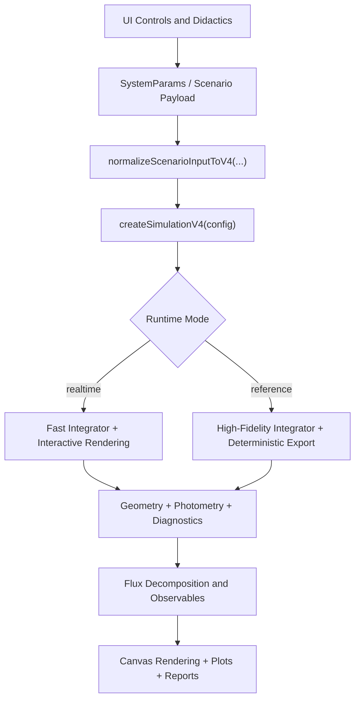
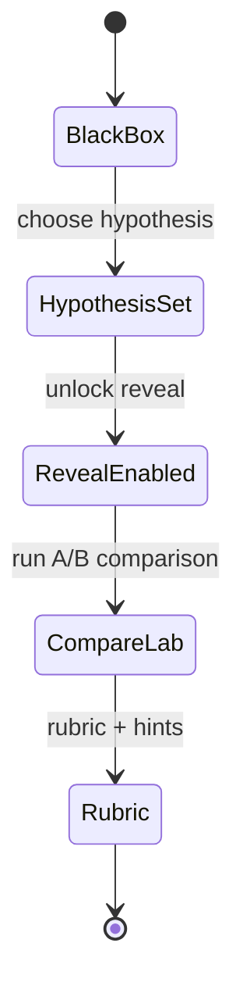

# Exoplanet Exomoon Simulation


Interactive browser simulation for exoplanet transit photometry, binary eclipses, exomoon scenarios, and timing diagnostics. The core is deterministic and SI-based, with a didactic UI flow for black-box exploration and hypothesis-driven learning.

## Table of Contents

- [Highlights](#highlights)
- [Architecture](#architecture)
- [Quick Start](#quick-start)
- [Runtime Modes](#runtime-modes)
- [Real Systems Snapshot](#real-systems-snapshot)
- [Scripts](#scripts)
- [Documentation](#documentation)
- [Project Layout](#project-layout)
- [Quality Gates](#quality-gates)
- [Known Limits](#known-limits)

## Highlights

- Native V4 runtime path with automatic legacy input migration.
- Detached eclipsing binary lab as default teaching mode.
- Realtime and reference runtime profiles.
- Transit, limb darkening, atmosphere hooks, phase curves, and instrument noise.
- Dynamic diagnostics (timing, conservation, RV, astrometry).
- Didactics: black-box flow, hypothesis gate, locks, hints, compare labs, rubric scoring.
- Versioned "real systems" snapshot from NASA Exoplanet Archive.

## Architecture



Didactic progression in Binary Lab:



## Quick Start

Recommended:

```bash
pnpm install --frozen-lockfile
pnpm dev
```

Open [http://localhost:5173](http://localhost:5173).

Alternative:

```bash
npm install
npm run dev
```

## Runtime Modes

- `Binary lab` is the default flow.
- `Preset / real systems` can be selected at any time.
- `Runtime mode` supports:
  - `realtime`: interactive stepping.
  - `reference`: more conservative numerical depth.

Main runtime entry points:

- `src/sim/v4/runtime.ts`
- `src/app/v4Runtime.ts`

## Real Systems Snapshot

The `Real systems` dropdown uses a versioned snapshot in:

- `src/config/real-systems.snapshot.json`

Manual refresh command:

```bash
pnpm data:real-systems:refresh
```

This keeps app startup deterministic and avoids frontend runtime API calls.

## Scripts

- `pnpm dev`: start Vite dev server
- `pnpm build`: production build
- `pnpm preview`: preview build
- `pnpm lint`: lint and formatting checks
- `pnpm typecheck`: TypeScript checks
- `pnpm test`: unit and smoke tests
- `pnpm ci:verify`: lint + typecheck + test + build
- `pnpm migrate:v4`: migrate legacy scenario payloads to V4
- `pnpm literature-benchmarks`: benchmark gate
- `pnpm didactics-acceptance`: didactics flow gate
- `pnpm perf-smoke`: performance smoke gate
- `pnpm migration-regression`: migration gate

## Documentation

| Topic                     | Path                              |
| ------------------------- | --------------------------------- |
| Docs index                | `docs/README.md`                  |
| Parameters and UI mapping | `docs/params.md`                  |
| Physics overview          | `docs/physics/overview.md`        |
| Full derivation           | `docs/physics/full-derivation.md` |
| N-body details            | `docs/physics/nbody.md`           |
| Orbit model               | `docs/physics/orbits.md`          |
| Relativity model          | `docs/physics/relativity.md`      |
| Photometry model          | `docs/physics/photometry.md`      |
| Validation and warnings   | `docs/validation.md`              |
| CI model                  | `docs/ci.md`                      |
| Runbook                   | `docs/RUNBOOK.md`                 |
| Contributing              | `CONTRIBUTING.md`                 |
| Security policy           | `SECURITY.md`                     |

## Project Layout

```text
src/
  app/         scenario selection, runtime builders, didactics wiring
  config/      defaults and real-systems snapshot
  core/        shared types and units
  didactics/   lesson engine, rubric, reports
  photometry/  transit and additive flux components
  physics/     kepler, frames, relativity, utility math
  render/      canvas scene and overlays
  sim/         runtime orchestration and integrators
  ui/          DOM references and parameter mapping
```

## Quality Gates

Primary local verification:

```bash
pnpm ci:verify
pnpm literature-benchmarks
pnpm didactics-acceptance
pnpm perf-smoke
pnpm migration-regression
```

## Known Limits

- Relativity corrections are modelled with practical approximations for browser execution.
- Atmospheric and stellar modules expose advanced hooks but are not a full radiative-transfer research solver.
- Some high-fidelity effects are intentionally profile-gated to preserve interactive performance.

## Contributing and Security

- Contribution guidelines: `CONTRIBUTING.md`
- Security reporting: `SECURITY.md`

## License

MIT, see `LICENSE`.
