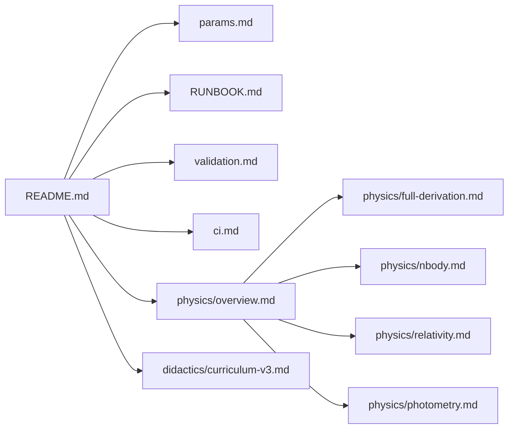

# Documentation Index

This folder contains architecture, physics, runtime, and operations documentation for the simulation.

## Reading paths

- New contributor: start with `../README.md`, then `RUNBOOK.md`, then `params.md`
- Physics deep dive: `physics/overview.md` -> `physics/full-derivation.md`
- CI and release checks: `ci.md`, `validation.md`
- Didactics flow: `didactics/curriculum-v3.md`

## Map

Ephemeral local inspection notes should stay outside the maintained docs set (see `.gitignore` patterns).
