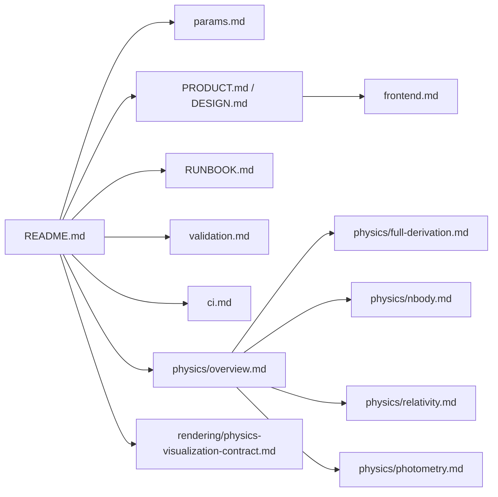

# Documentation Index

This folder contains the maintained architecture, physics, frontend, validation, and operations documentation for Transit Light-Curve Lab.

## Reading paths

- New contributor: start with `../README.md`, then `RUNBOOK.md`, then `params.md`
- Frontend/product work: `../PRODUCT.md` -> `../DESIGN.md` -> `frontend.md`
- Runtime/data flow: `../README.md` architecture diagrams, then `src/main.ts` -> `src/app/bootstrap.ts` -> `src/app/v4Runtime.ts`
- Physics deep dive: `physics/overview.md` -> `physics/full-derivation.md`
- CI and release checks: `ci.md`, `validation.md`
- Didactics flow: start with the Binary Lab section in `../README.md` and the visualization contract in `rendering/physics-visualization-contract.md`
- GitHub screenshot capture command: `pnpm capture:github-screenshots`
- Public/private repository boundary: `pnpm hygiene:public`

## Map

Ephemeral local inspection notes should stay outside the maintained docs set (see `.gitignore`).
Generated maps, one-off verification baselines, audit ledgers, status snapshots, and superseded
planning packets are local-only material by default.

Generated build, coverage, browser-report, and tool-runtime directories are also local-only. Run
`pnpm clean` to remove generated verification output and `pnpm hygiene:public` before preparing a
public change.

Completed or superseded plan/status/ledger artifacts belong under ignored `docs/archive/` content
for handoff traceability. They are not part of the maintained reading path and should not be
included in routine commits unless a reviewer explicitly asks for the historical packet.
