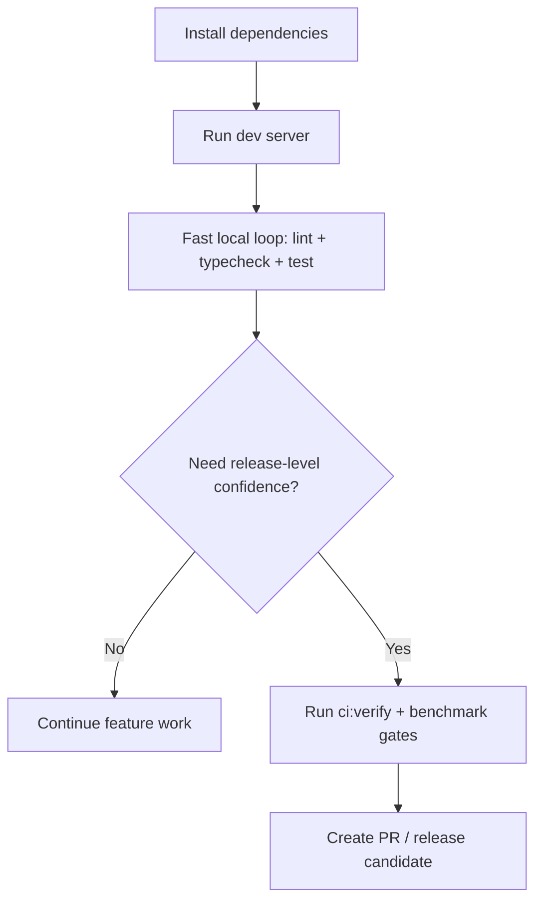

# RUNBOOK

## Purpose

Repeatable commands for setup, development, verification, and security checks.

## Workflow



## Prerequisites

- Node.js 18+ (recommended)
- pnpm 9.x for local development (lockfile present)

## Setup

Recommended (reproducible):

```bash
pnpm install --frozen-lockfile
```

## Dev Server

```bash
pnpm dev
```

Open `http://localhost:5173`.

## Fast Loop (local)

```bash
pnpm lint
pnpm typecheck
pnpm test
```

## Full Loop (CI parity)

```bash
pnpm ci:verify
```

Optional release-level gates:

```bash
pnpm literature-benchmarks
pnpm didactics-acceptance
pnpm perf-smoke
pnpm migration-regression
```

## Lint / Format

```bash
pnpm lint
pnpm format:check
pnpm format
```

## Typecheck

```bash
pnpm typecheck
```

## Tests

```bash
pnpm test
pnpm test:watch
```

## Build / Preview

```bash
pnpm build
pnpm preview
```

## Security (Current Tooling)

Hosted workflows run secret scanning and CodeQL on PR/push. Dependency audit runs weekly or by
manual dispatch. Local dependency security scanning is optional.

Dependency scan (SCA):

```bash
pnpm audit --audit-level=moderate
```

Notes:

- `pnpm audit` requires network access.
- Secret scanning is handled in CI via `gitleaks`.
- SAST is handled in CI via CodeQL.

## Troubleshooting

- If `pnpm` is missing, install pnpm 9.x and re-run `pnpm install --frozen-lockfile`.
- If `npm run dev` or `pnpm dev` fails with `sh: vite: command not found`, `node_modules` is missing or incomplete. Reinstall with pnpm.
- If Vite still fails to start after reinstall, clear `node_modules` and reinstall.

```bash
rm -rf node_modules
pnpm install --frozen-lockfile
```
