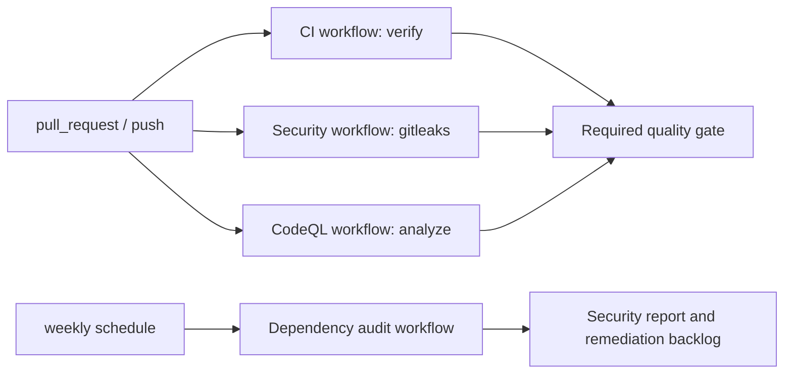

# CI Overview

## Goals

- Deterministic and reproducible checks.
- Fast feedback for pull requests.
- Security coverage with least-privilege workflow permissions.

## Pipeline at a glance



## Workflows

- `CI` (`.github/workflows/ci.yml`)
  - Triggers: `pull_request` against `dev`, `push` on `dev`
  - Jobs (run in dependency order):
    1. `lint` — `pnpm ci:lint` (Node 22)
    2. `typecheck` — `pnpm ci:typecheck` (Node 22)
    3. `test` — `pnpm ci:test` (Node 20 and 22, matrix)
    4. `build` — `pnpm ci:build` (Node 22, needs lint + typecheck)
    5. `quality-gates` — literature benchmarks, didactics acceptance, perf smoke, physics regression, migration regression (Node 22, needs test)
  - Cache: pnpm store via `actions/cache` (`~/.pnpm-store`)

- `Security` (`.github/workflows/security.yml`)
  - Triggers: `pull_request` against `dev`, `push` on `dev`
  - Job: `gitleaks`

- `CodeQL` (`.github/workflows/codeql.yml`)
  - Triggers: `pull_request` against `dev`, `push` on `dev`, weekly schedule
  - Job: `analyze`

- `Dependency Audit` (`.github/workflows/dependency-audit.yml`)
  - Triggers: weekly schedule, `workflow_dispatch`
  - Main command: `pnpm audit --audit-level=high --prod`
  - Scope: production dependency graph only (deterministic PR behavior, runtime-first risk focus)

## Local execution

Full local CI parity:

```bash
./scripts/ci-local.sh
```

Optional local security dependency audit:

```bash
CI_AUDIT=1 ./scripts/ci-local.sh
```

Equivalent manual steps:

```bash
pnpm install --frozen-lockfile
pnpm ci:verify
pnpm audit:security
```

## Determinism controls

- OS is pinned (`ubuntu-24.04`).
- Node is pinned in CI (22).
- pnpm is pinned (`pnpm@9.0.0` via Corepack).
- Lockfile is enforced (`--frozen-lockfile`).

## Required checks for merge

- `pnpm lint`
- `pnpm typecheck`
- `pnpm test`
- `pnpm build`
- Optional strict gates used in release prep:
  - `pnpm literature-benchmarks`
  - `pnpm didactics-acceptance`
  - `pnpm perf-smoke`
  - `pnpm migration-regression`

## Secrets and permissions

Current workflows do not require repository secrets for standard verification.
If deployment/secrets are added later:

- run only on trusted triggers (`push`/`workflow_dispatch`),
- use GitHub Environments with approval,
- keep workflow permissions minimal.

## Release checklist

Before cutting a release (tag or GitHub release):

1. Run full verification: `pnpm ci:verify`
2. Optionally run strict gates: `pnpm literature-benchmarks`, `pnpm didactics-acceptance`, `pnpm perf-smoke`, `pnpm migration-regression`
3. Ensure `CHANGELOG.md` has a versioned section for the release
4. Tag the version (e.g. `git tag v0.1.0`) and push
5. Optional: refresh real-systems snapshot with `pnpm data:real-systems:refresh` if you want the release to ship updated NASA data

## Extending CI safely

- Keep PR checks fast (`lint`, `typecheck`, `test`, `build`).
- Run expensive or non-deterministic checks on schedule/manual triggers.
- Always set `timeout-minutes`, explicit permissions, and caching strategy.
