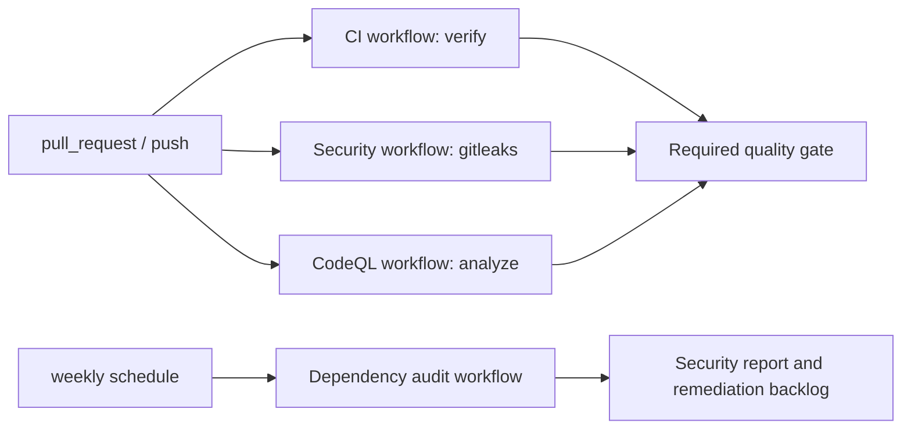

# CI Overview

## Goals

- Deterministic and reproducible checks.
- Fast feedback for pull requests.
- Security coverage with least-privilege workflow permissions.

## Pipeline at a glance



## Workflows

- `CI` (`.github/workflows/ci.yml`)
  - Triggers: `pull_request` against `main`/`dev`, `push` on `main`/`dev`
  - Jobs (run in dependency order):
    1. `lint` — public-surface hygiene plus ESLint/Prettier via `pnpm ci:lint` (Node 22)
    2. `typecheck` — `pnpm ci:typecheck` (Node 22)
    3. `test` — `pnpm ci:test` (Node 20 and 22, matrix)
    4. `build` — `pnpm ci:build` (Node 22, needs lint + typecheck)
    5. `e2e` — Playwright Chromium E2E against the built preview app (Node 22, needs build)
    6. `quality-gates` — literature benchmarks, didactics acceptance, perf smoke, physics regression, migration regression (Node 22, needs test)
  - Cache: pnpm store via `actions/cache` (`~/.pnpm-store`)

- `Security` (`.github/workflows/security.yml`)
  - Triggers: `pull_request` against `main`/`dev`, `push` on `main`/`dev`
  - Job: `gitleaks`

- `CodeQL` (`.github/workflows/codeql.yml`)
  - Triggers: `pull_request` against `main`/`dev`, `push` on `main`/`dev`, weekly schedule
  - Job: `analyze`

- `Dependency Audit` (`.github/workflows/dependency-audit.yml`)
  - Triggers: weekly schedule, `workflow_dispatch`
  - Main command: `pnpm audit --audit-level=moderate`
  - Scope: full installed dependency graph, including toolchain packages used by local and CI workflows

## Local execution

Hosted CI is the baseline PR/push gate. The local release-confidence loop is broader and is the
authoritative command before release prep:

```bash
./scripts/ci-local.sh
```

It installs from the lockfile, runs `pnpm ci:verify`, installs the Playwright Chromium browser if
needed, runs browser E2E, probes the served browser shell, checks coverage, runs dependency hygiene,
and executes the literature, scientific calibration, didactics, performance, physics, and migration
gates.

Add the high-threshold dependency security audit when needed. This local release-confidence variant
uses `pnpm audit --audit-level=high` after the standard gates; the hosted dependency-audit workflow
uses the stricter moderate threshold on a weekly/manual cadence.

```bash
CI_AUDIT=1 ./scripts/ci-local.sh
```

Default correctness tests and coverage exclude the perf timing smoke; `pnpm perf-smoke` remains the
dedicated performance gate.

## Determinism controls

- OS is pinned (`ubuntu-24.04`).
- Node is pinned in CI: tests run on Node 20 and 22; lint, typecheck, build, and quality gates run on Node 22.
- pnpm is pinned (`pnpm@9.0.0` via Corepack).
- Lockfile is enforced (`--frozen-lockfile`).

## Required checks for merge

- `pnpm lint`
- `pnpm hygiene:public`
- `pnpm typecheck`
- `pnpm test`
- `pnpm build`
- `pnpm test:e2e`
- Optional strict gates used in release prep:
  - `pnpm literature-benchmarks`
  - `pnpm didactics-acceptance`
  - `pnpm perf-smoke`
  - `pnpm migration-regression`

## Secrets and permissions

Current workflows do not require repository secrets for standard verification.
If deployment/secrets are added later:

- run only on trusted triggers (`push`/`workflow_dispatch`),
- use GitHub Environments with approval,
- keep workflow permissions minimal.

## Release checklist

Before cutting a release (tag or GitHub release):

1. Run full verification: `./scripts/ci-local.sh`
2. Optionally run security audit in the same pass: `CI_AUDIT=1 ./scripts/ci-local.sh`
3. Ensure `CHANGELOG.md` has a versioned section for the release
4. Tag the version (e.g. `git tag v0.1.0`) and push
5. Optional: refresh real-systems snapshot with `pnpm data:real-systems:refresh` if you want the release to ship updated NASA data

## Extending CI safely

- Keep PR checks fast (`lint`, `typecheck`, `test`, `build`).
- Run expensive or non-deterministic checks on schedule/manual triggers.
- Always set `timeout-minutes`, explicit permissions, and caching strategy.
