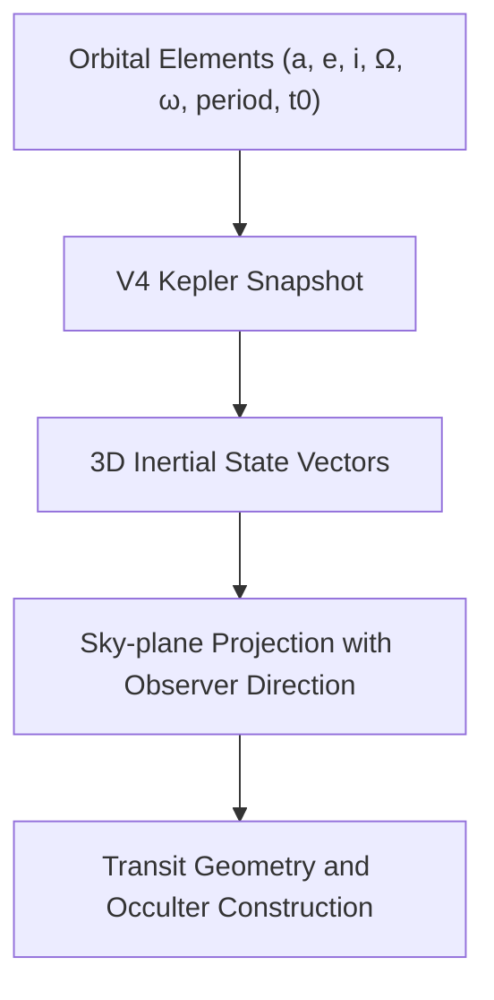
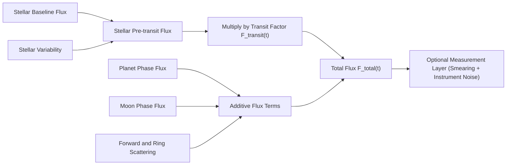

# Physics Overview and Execution Truth Boundary

This simulator uses SI units internally:

- Length: meters (m).
- Time: seconds (s).
- Angles: radians in the model (UI uses degrees and converts).
- Gravitational parameter: $\mu = GM$ in m^3/s^2.

## Which runtime executes which physics

There are three distinct paths. They must not be described as interchangeable:

| Path                                      | Actual dynamics                                                         | Scientific status                                                                                                     |
| ----------------------------------------- | ----------------------------------------------------------------------- | --------------------------------------------------------------------------------------------------------------------- |
| V4 browser runtime (`createSimulationV4`) | Independently parameterized Kepler snapshots                            | Educational preview                                                                                                   |
| Compatibility kernel (`stepSystem`)       | Kepler or optional velocity-Verlet N-body, plus optional timing helpers | Bounded implementation used by tests and legacy callers; not the shipped V4 engine                                    |
| V5/local backend                          | Explicit-epoch barycentric Newtonian DOP853 when SciPy is available     | Bounded scientific computation with a validated input/execution contract and complete manifest; otherwise fail closed |

V4 always constructs Kepler snapshots. The strict `scientific-browser` V4
validation profile rejects requests that enable N-body or relativity with a
structured unavailable-capability error. Interactive V4 may accept those
configuration flags, but it does not execute those solvers and reports them as
unavailable/not run; it is never labelled as an N-body or relativity result.
Its `reference` profile means deterministic in-thread supersampling, not an
independent solver.

At each V4 preview time `t`, the runtime computes 3D Kepler states, sky-plane
geometry, relative stellar/transit flux, optional educational additive terms,
and diagnostics. Some formulas also exist in the compatibility kernel, but
their presence in the repository does not imply that V4 calls them.

## Physics Diagram 1: Orbital State to Sky Projection

## Physics Diagram 2: Flux Composition Model

The default runtime entry point is `createSimulationV4(config).step(tObsSec)` in `src/sim/v4/runtime.ts`.
`stepSystem(params, tSec)` in `src/sim/sim.ts` remains the internal physics kernel used by compatibility and focused module tests.

Current runtime note:

- The shipped default path is the interactive V4 browser runtime.
- The active native V4 path now carries forward scattering, ring scattering, and bounded atmosphere-refraction terms into `flux.total` and into the exported `renderSignals.fluxComponents` decomposition.
- `scientific-browser` is a strict V4 validation profile, not a scientific
  solver. It rejects unsupported N-body and relativity requests and remains
  educational when it succeeds.
- Bounded V5 scientific jobs use the separate contract/local backend and
  require a provenance-complete manifest. Unsupported capabilities fail
  closed. A complete manifest is execution evidence, not independent research
  validation.

Runtime contracts and consistency:

- `src/sim/observerContract.ts` enforces strict time/observer invariants.
- `src/sim/stateSampler.ts` is the shared sampler for diagnostics and observables.
- `src/sim/v4/runtime.ts` maps core results to the V3-compatible step contract (`SimulationStepV3`) with:
  - `renderSignals` (canonical rendering contract)
  - `physicsDiagnostics` (timing/integrator/conservation visibility)

Rendering/debug contract:

- `src/app/frameLoopControllerLogic.ts` calls `Canvas2DRenderer.drawFrameV3(...)` with the active simulation step payload.
- The active UI path does not require a legacy step payload.
- Debug overlays consume `drawDebugOverlay...` data mapped from:
  - `simulationStep.debug`
  - `simulationStep.flux`
  - `simulationStep.renderSignals`

Learner-visible visualization contract:

- The light-curve plot reads `eventMarkers`, `timingMarkers`, `fluxComponents`, comparison insets, and observer-side window overlays from the step payload and app state.
- The sky-plane canvas reads the same step payload plus scene ghosts and didactic overlay badges.
- The current contract is documented in `docs/rendering/physics-visualization-contract.md`.
- The active UI distinguishes `physical` and `measured` lanes:
  - `physical`: the native/runtime flux surface and its decomposition
  - `measured`: the same underlying physics after cadence smearing and bounded instrument/observer contamination

Preview fidelity and feature gates:

- `dynamics.fidelityProfile`: `interactive | accurate | reference`; these are
  preview sampling profiles, not levels of scientific validation.
- `dynamics.physicsFeatures.*`: explicit toggles for advanced modules.

Coordinate system and projection:

- Orbits are defined in a 3D inertial frame using Kepler elements.
- Observer direction $\mathbf{n}_{\mathrm{obs}}$ points from the star toward the observer.
- A body is "in front" of the star if $\mathbf{r} \cdot \mathbf{n}_{\mathrm{obs}} > 0$.
- Sky-plane projection uses the basis in `src/physics/frames.ts`.

## Didactic use-cases (UI presets)

Use the `Preset` dropdown in the UI (implemented in `src/app/presets.ts`) as a guided path:

1. `Kepler: planet-only transit`
   - Demonstrates the geometry of transits (impact parameter, ingress/egress).
   - Recommended knobs: `planetInc`, `planetR`, `observerZ`, `gridRes`, limb darkening (`ldU1/ldU2`).
2. `Limb darkening: multi-band variation`
   - Demonstrates how stronger LD changes ingress/egress curvature and depth normalization.
   - Use `ldBandpass` to switch `bands` (multi-band coefficients).
3. `Dynamics/timing comparison`
   - Demonstrates preview timing and velocity diagnostics. V4 does not execute
     its N-body toggle; use the compatibility kernel only for bounded tests or
     a capability-confirmed V5 backend for research propagation.

For a complete mapping of UI fields to model paths and units, see `docs/params.md`.

Key files:

- Orbits and elements: `src/physics/kepler.ts`, `src/sim/orbits.ts`
- Kinematics and projection: `src/sim/kinematics.ts`
- N-body dynamics: `src/sim/dynamics.ts`
- Relativity and timing: `src/physics/relativity.ts`
- Photometry: `src/sim/transitFlux.ts`, `src/photometry/*`
- Runtime V4 mapping: `src/sim/v4/runtime.ts`
- V3 render entry: `src/app/frameLoopControllerLogic.ts`, `src/render/canvas2d.ts`
- V3 debug overlay: `src/render/overlays.ts`
- Rendering contract: `docs/rendering/physics-visualization-contract.md`
- Photometry details: `docs/physics/photometry.md`
- Model ownership and validation status: `docs/physics/model-registry.json`,
  `docs/physics/model-status.md`
- V5 scientific contract: `docs/physics/v5-scientific-contract.md`
