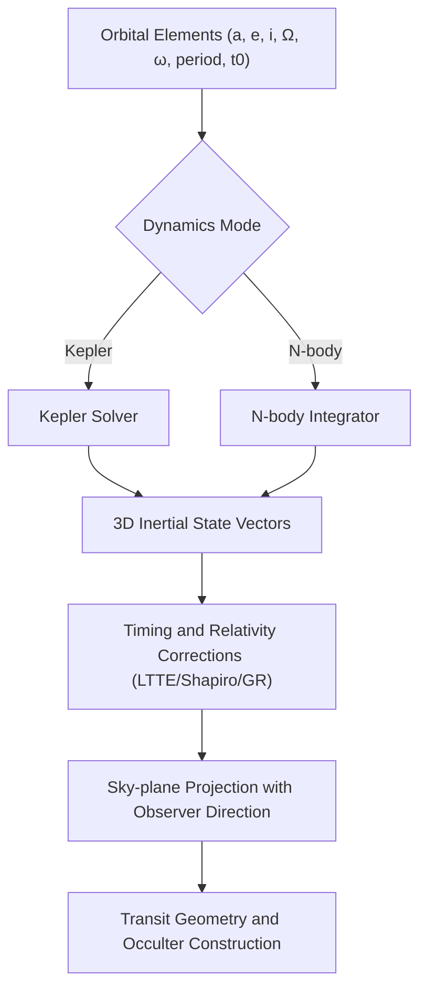
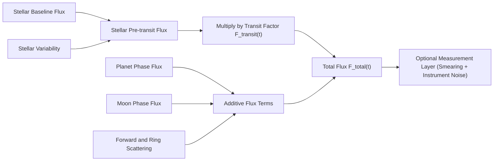

# Physics Overview

This simulator uses SI units internally:

- Length: meters (m).
- Time: seconds (s).
- Angles: radians in the model (UI uses degrees and converts).
- Gravitational parameter: $\mu = GM$ in m^3/s^2.

## What is simulated (short)

At each time `t` the simulator computes:

1. 3D inertial positions (Kepler or N-body) and a sky-plane projection.
2. A **multiplicative** stellar transit attenuation factor $F_{\mathrm{transit}}(t) \in [0,1]$.
3. Optional **additive** flux terms (phase curves, variability, forward scattering, …).
4. Optional observables bundle (RV, astrometry, timing/conservation diagnostics).

## Physics Diagram 1: Orbital State to Sky Projection

## Physics Diagram 2: Flux Composition Model

The public runtime entry point is `createSimulation(config).step(tObsSec)` in `src/sim/v3/runtime.ts`.
`stepSystem(params, tSec)` in `src/sim/sim.ts` remains the internal physics kernel used by the runtime.

Runtime contracts and consistency:

- `src/sim/observerContract.ts` enforces strict time/observer invariants.
- `src/sim/stateSampler.ts` is the shared sampler for diagnostics and observables.
- `src/sim/v3/runtime.ts` maps core results to `SimulationStepV3` with:
  - `renderSignals` (canonical rendering contract)
  - `physicsDiagnostics` (timing/integrator/conservation visibility)

V3 rendering/debug contract:

- `src/render/scene.ts` accepts `SimulationStepV3` and dispatches to `drawFrameV3(...)`.
- `SimulationStepV3` no longer exposes a `legacyStep` payload in the active UI path.
- Debug overlays consume `drawDebugOverlayV3(...)` data mapped from:
  - `SimulationStepV3.debug`
  - `SimulationStepV3.flux`
  - `SimulationStepV3.renderSignals`

Fidelity and feature gates:

- `dynamics.fidelityProfile`: `interactive | accurate | reference`.
- `dynamics.physicsFeatures.*`: explicit toggles for advanced modules.

Coordinate system and projection:

- Orbits are defined in a 3D inertial frame using Kepler elements.
- Observer direction $\mathbf{n}_{\mathrm{obs}}$ points from the star toward the observer.
- A body is "in front" of the star if $\mathbf{r} \cdot \mathbf{n}_{\mathrm{obs}} > 0$.
- Sky-plane projection uses the basis in `src/physics/frames.ts`.

## Didactic use-cases (UI presets)

Use the **Preset** dropdown in the UI (implemented in `src/app/presets.ts`) as a guided path:

1. **Kepler: planet-only transit**
   - Demonstrates the geometry of transits (impact parameter, ingress/egress).
   - Recommended knobs: `planetInc`, `planetR`, `observerZ`, `gridRes`, limb darkening (`ldU1/ldU2`).
2. **Limb darkening: multi-band variation**
   - Demonstrates how stronger LD changes ingress/egress curvature and depth normalization.
   - Use `ldBandpass` to switch `bands` (multi-band coefficients).
3. **N-body: perturber + star reflex**
   - Demonstrates how coupled dynamics can produce timing/velocity changes (TTV/TDV-style diagnostics).
   - Recommended knobs: `nbodyDtMax`, perturber orbit/mu, and the plot mode (physical vs measured).

For a complete mapping of UI fields to model paths and units, see `docs/params.md`.

Key files:

- Orbits and elements: `src/physics/kepler.ts`, `src/sim/orbits.ts`
- Kinematics and projection: `src/sim/kinematics.ts`
- N-body dynamics: `src/sim/dynamics.ts`
- Relativity and timing: `src/physics/relativity.ts`
- Photometry: `src/sim/transitFlux.ts`, `src/photometry/*`
- Runtime V3 mapping: `src/sim/v3/runtime.ts`
- V3 render entry: `src/render/scene.ts`, `src/render/canvas2d.ts`
- V3 debug overlay: `src/render/overlays.ts`
- Rendering contract: `docs/rendering/physics-visualization-contract.md`
