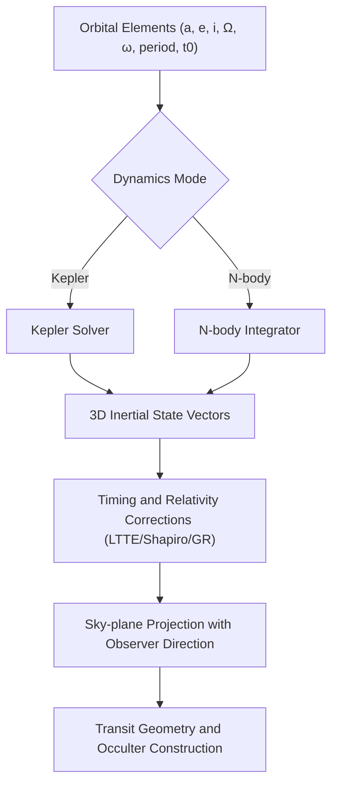
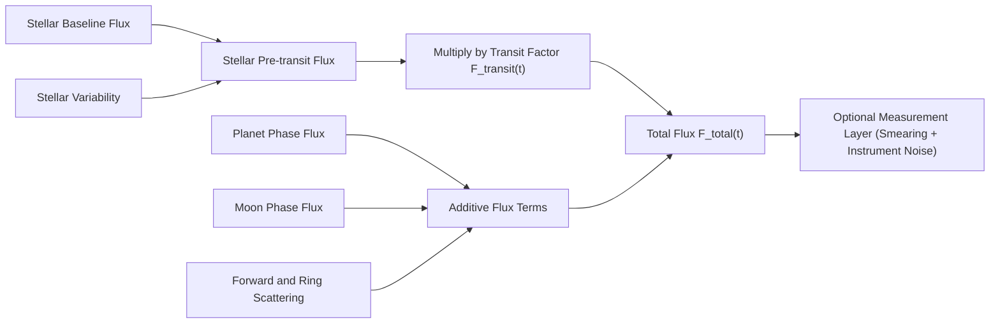

# Physics Overview

This simulator uses SI units internally:

- Length: meters (m).
- Time: seconds (s).
- Angles: radians in the model (UI uses degrees and converts).
- Gravitational parameter: $\mu = GM$ in m^3/s^2.

## What is simulated (short)

At each time `t` the simulator computes:

1. 3D inertial positions (Kepler or N-body) and a sky-plane projection.
2. A stellar flux bundle together with a diagnostic **transit attenuation factor** $F_{\mathrm{transit}}(t) \in [0,1]$.
3. Optional **additive** flux terms (phase curves, variability, forward scattering, ring scattering, refraction, ...).
4. Optional observables bundle (RV, astrometry, timing/conservation diagnostics).

## Physics Diagram 1: Orbital State to Sky Projection

## Physics Diagram 2: Flux Composition Model

The default runtime entry point is `createSimulationV4(config).step(tObsSec)` in `src/sim/v4/runtime.ts`.
`stepSystem(params, tSec)` in `src/sim/sim.ts` remains the internal physics kernel used by compatibility and focused module tests.

Current runtime note:

- The shipped default path is the interactive V4 browser runtime.
- The active native V4 path now carries forward scattering, ring scattering, and bounded atmosphere-refraction terms into `flux.total` and into the exported `renderSignals.fluxComponents` decomposition.
- The separate `scientific-browser` execution path is stricter than the default interactive shell and may reject some additive photometry channels until they are explicitly supported there.
- The `scientific-browser` path remains a bounded validation/runtime contract rather than a claim of finished high-fidelity scientific coverage.

Runtime contracts and consistency:

- `src/sim/observerContract.ts` enforces strict time/observer invariants.
- `src/sim/stateSampler.ts` is the shared sampler for diagnostics and observables.
- `src/sim/v4/runtime.ts` maps core results to the V3-compatible step contract (`SimulationStepV3`) with:
  - `renderSignals` (canonical rendering contract)
  - `physicsDiagnostics` (timing/integrator/conservation visibility)

Rendering/debug contract:

- `src/render/scene.ts` accepts the active simulation step payload and dispatches the canonical draw path.
- The active UI path does not require a legacy step payload.
- Debug overlays consume `drawDebugOverlay...` data mapped from:
  - `simulationStep.debug`
  - `simulationStep.flux`
  - `simulationStep.renderSignals`

Learner-visible visualization contract:

- The light-curve plot reads `eventMarkers`, `timingMarkers`, `fluxComponents`, comparison insets, and observer-side window overlays from the step payload and app state.
- The sky-plane canvas reads the same step payload plus scene ghosts and didactic overlay badges.
- The current contract is documented in `docs/rendering/physics-visualization-contract.md`.
- The active UI distinguishes `physical` and `measured` lanes:
  - `physical`: the native/runtime flux surface and its decomposition
  - `measured`: the same underlying physics after cadence smearing and bounded instrument/observer contamination

Fidelity and feature gates:

- `dynamics.fidelityProfile`: `interactive | accurate | reference`.
- `dynamics.physicsFeatures.*`: explicit toggles for advanced modules.

Coordinate system and projection:

- Orbits are defined in a 3D inertial frame using Kepler elements.
- Observer direction $\mathbf{n}_{\mathrm{obs}}$ points from the star toward the observer.
- A body is "in front" of the star if $\mathbf{r} \cdot \mathbf{n}_{\mathrm{obs}} > 0$.
- Sky-plane projection uses the basis in `src/physics/frames.ts`.

## Didactic use-cases (UI presets)

Use the **Preset** dropdown in the UI (implemented in `src/app/presets.ts`) as a guided path:

1. **Kepler: planet-only transit**
   - Demonstrates the geometry of transits (impact parameter, ingress/egress).
   - Recommended knobs: `planetInc`, `planetR`, `observerZ`, `gridRes`, limb darkening (`ldU1/ldU2`).
2. **Limb darkening: multi-band variation**
   - Demonstrates how stronger LD changes ingress/egress curvature and depth normalization.
   - Use `ldBandpass` to switch `bands` (multi-band coefficients).
3. **N-body: perturber + star reflex**
   - Demonstrates how coupled dynamics can produce timing/velocity changes (TTV/TDV-style diagnostics).
   - Recommended knobs: `nbodyDtMax`, perturber orbit/mu, and the plot mode (physical vs measured).

For a complete mapping of UI fields to model paths and units, see `docs/params.md`.

Key files:

- Orbits and elements: `src/physics/kepler.ts`, `src/sim/orbits.ts`
- Kinematics and projection: `src/sim/kinematics.ts`
- N-body dynamics: `src/sim/dynamics.ts`
- Relativity and timing: `src/physics/relativity.ts`
- Photometry: `src/sim/transitFlux.ts`, `src/photometry/*`
- Runtime V4 mapping: `src/sim/v4/runtime.ts`
- V3 render entry: `src/render/scene.ts`, `src/render/canvas2d.ts`
- V3 debug overlay: `src/render/overlays.ts`
- Rendering contract: `docs/rendering/physics-visualization-contract.md`
- Photometry details: `docs/physics/photometry.md`
