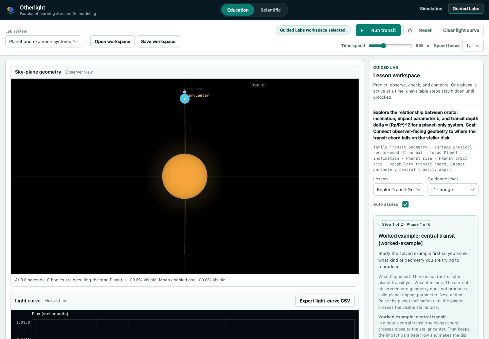
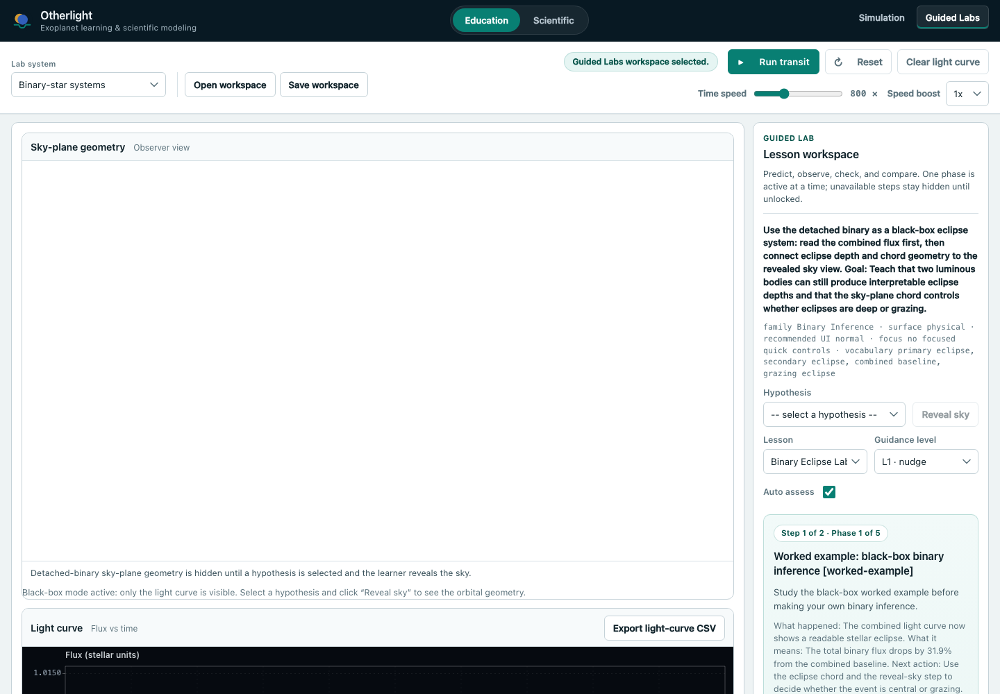
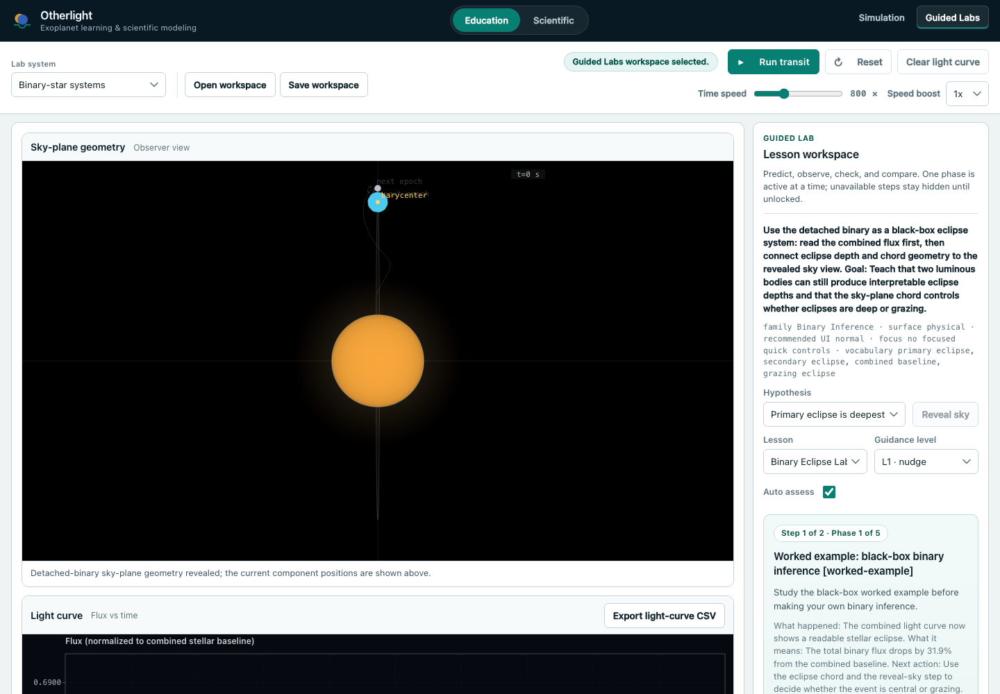
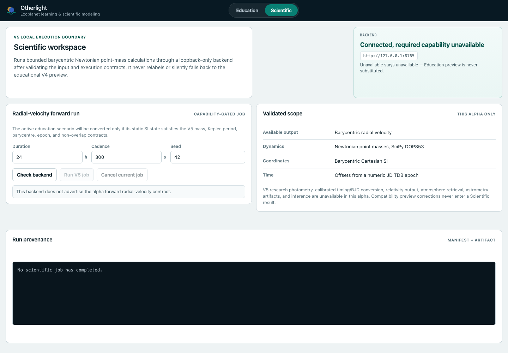
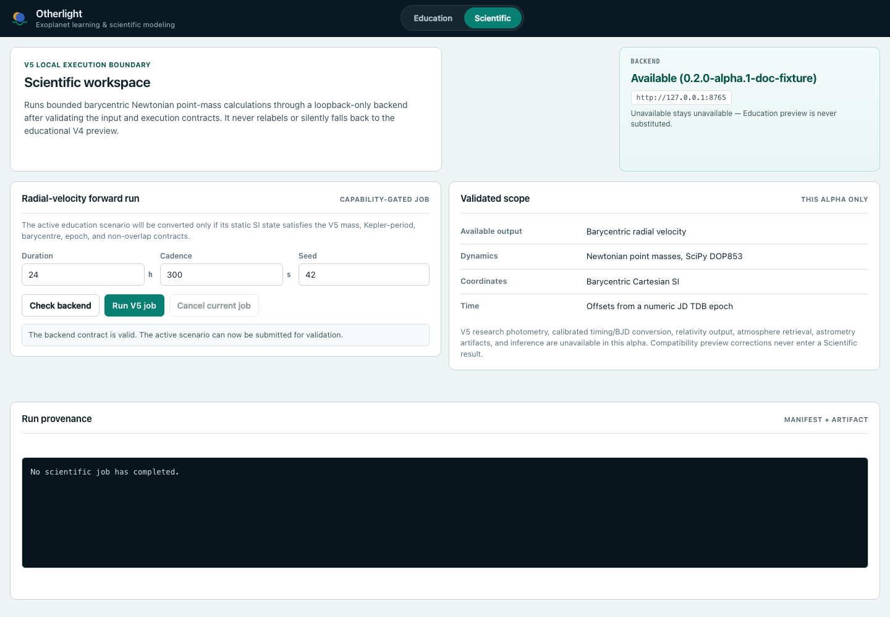
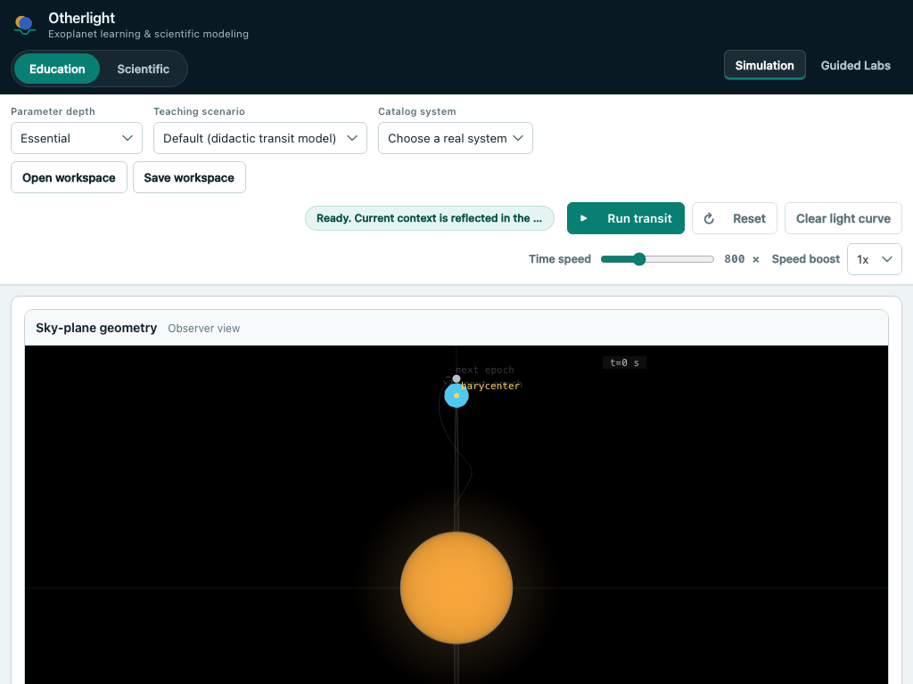
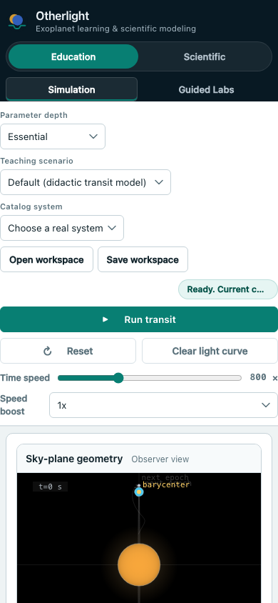

# Screenshot tour

The maintained browser gallery contains ten Chromium captures. Its manifest
records the application version, capture-time Git boundary, browser version,
viewport, scenario, image dimensions, and SHA-256 digest for each frame.

The gallery was captured from a dirty working tree at revision
`77555e131da9931c9974011dbe10c505273d4814`. It is interface evidence, not an
immutable release record.

## Browser gallery

| Frame                                                                    | Surface                                          |
| ------------------------------------------------------------------------ | ------------------------------------------------ |
|      | Education simulation at 1440 by 1000             |
|                          | Guided Labs at 1440 by 1000                      |
|              | Binary-star lab before geometry reveal           |
|                | Binary-star lab after geometry reveal            |
|  | Scientific capability unavailable                |
|              | Scientific capability ready                      |
|            | Completed Scientific result from contract replay |
|              | Education at 1024 by 768                         |
|              | Education at 390 by 844                          |
|                  | Education under dark system appearance           |

Frame 7 replays
`contracts/science-v5/contract-cases.json#validForwardResult`. It verifies the
completed-result interface. It does not show a new backend calculation or a
downloaded Arrow artifact.

## Browser capture modes

Capture with a temporary Vite development server:

```bash
pnpm capture:tour:web
```

Capture from a production build with route interception for the Scientific
states:

```bash
pnpm capture:tour:web:static
```

Capture frame 7 from an already running backend:

```bash
pnpm capture:tour:web:live
```

Only the live command submits a Scientific job, downloads the Arrow artifact,
and records its digest. The backend must be available on
`http://127.0.0.1:8765`.

Set `SCREENSHOT_DIR` to a temporary directory when reviewing new captures:

```bash
SCREENSHOT_DIR=/private/tmp/otherlight-web-review pnpm capture:tour:web
```

Validate the maintained gallery and its documentation:

```bash
pnpm verify:tour
```

## Required native Apple captures

The repository does not currently contain a native Apple gallery. A complete
gallery requires:

1. macOS simulation without the parameter inspector.
2. macOS simulation with the parameter inspector.
3. macOS Guided Lab.
4. iPad simulation.
5. iPad parameter sheet.
6. iPad Guided Lab.
7. iPhone simulation.
8. iPhone parameter sheet.
9. iPhone Guided Lab.
10. macOS simulation under dark system appearance.

The native application is Education-only, so a Scientific frame is not
expected. File pickers are excluded because they can display local paths or
user data.

Run the toolchain and destination preflight:

```bash
DEVELOPER_DIR=/Applications/Xcode-26.6.0.app/Contents/Developer \
  APPLE_SCREENSHOT_DIR=/private/tmp/otherlight-apple-review \
  pnpm capture:tour:apple --preflight
```

Capture to the review directory:

```bash
DEVELOPER_DIR=/Applications/Xcode-26.6.0.app/Contents/Developer \
  APPLE_SCREENSHOT_DIR=/private/tmp/otherlight-apple-review \
  pnpm capture:tour:apple
```

The native capture requires Xcode 26.6, Swift 6.3.3, the expected iOS 26.5
simulator destinations, and all Swift package dependencies.
